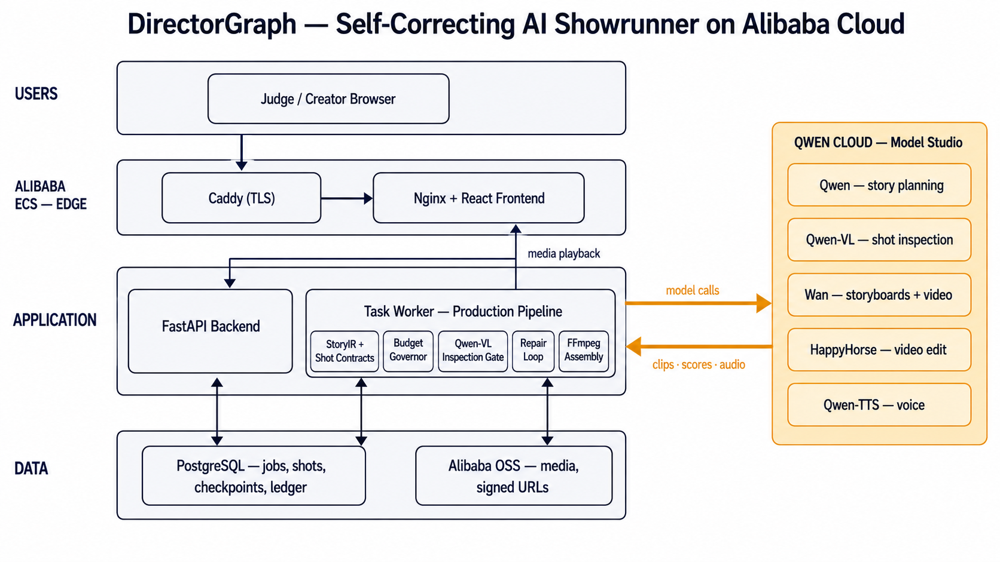

# DirectorGraph

**Track 2 AI Showrunner:** DirectorGraph is a budget-aware, self-correcting Qwen production studio that turns one brief into StoryIR, Shot Contracts, generated shots, inspection reports, repairs, captions, and a final short drama.

## Canonical stat block

| Measured fact | Value | Proof |
|---|---:|---|
| Public deployed master footage | 24s generated / 24s accepted | [`evidence/deployment/public-demo.json`](evidence/deployment/public-demo.json) |
| Public deployed master shots | 6 accepted / 6 planned | [`evidence/deployment/public-demo.json`](evidence/deployment/public-demo.json) |
| Public deployed renderer path | 6 `wan_r2v` shots / 0 local fallback | [`evidence/deployment/public-demo.json`](evidence/deployment/public-demo.json) |
| Qwen-VL accepted score range | 0.85-0.92 | [`evidence/deployment/public-demo.json`](evidence/deployment/public-demo.json) |
| Public deployed demo estimated cost (transparent internal rate card, not provider billing) | $3.4347 of $15.00 cap | [`evidence/deployment/public-demo.json`](evidence/deployment/public-demo.json) |
| Public deployed demo token ledger | 16,357 text+vision tokens | [`evidence/deployment/public-demo.json`](evidence/deployment/public-demo.json) |

<p align="center">
  
</p>

<p align="center"><strong>Brief in. Verified story graph out.</strong></p>

The name is literal: a **Director** that runs your production as a **Graph** — every scene, shot, and contract is a typed node it can inspect, score, and re-render on its own.

DirectorGraph transforms one creative brief into a typed narrative production graph, storyboards, dialogue, generated shots, contract-based quality reports, repaired footage, captions, and a final short drama.

Its defining behavior is not generation alone:

> DirectorGraph knows what every shot was supposed to communicate, verifies the rendered result, and repairs the smallest possible unit before export.

## Deployed on Alibaba Cloud

- **ECS live URL:** `https://directorgraph.47.84.232.193.sslip.io/`
- **OSS proof:** [`evidence/deployment/private-oss-access-check.json`](evidence/deployment/private-oss-access-check.json), [`evidence/deployment/public-demo-storage-manifest.json`](evidence/deployment/public-demo-storage-manifest.json)
- **Qwen/Wan/HappyHorse client code:** [`services/api/app/clients/qwen.py`](services/api/app/clients/qwen.py), [`services/api/app/providers/live.py`](services/api/app/providers/live.py)
- **Alibaba deployment proof:** [`docs/DEPLOYMENT_PROOF.md`](docs/DEPLOYMENT_PROOF.md), [`docs/HYBRID_ALIBABA_ARCHITECTURE.md`](docs/HYBRID_ALIBABA_ARCHITECTURE.md)

## Judge-visible differentiation

- **Narrative compiler:** converts a brief into versioned `StoryIR`, beats, characters, visual rules, and machine-readable Shot Contracts.
- **Self-healing video loop:** Qwen-VL compares each clip with its contract and routes isolated defects to local repair rather than blindly regenerating the entire film.
- **Budget Governor:** assigns salience, models, resolution, retries, and a protected repair reserve under a fixed production budget. It governs in dollars because multimodal token spend maps directly to compute cost — LLM tokens are priced inline while video seconds carry the real weight — and live production is additionally capped by a hard dollar ceiling (`enforce_live_spend_cap`) that cannot be exceeded regardless of retries.
- **Semantic Patch Rendering:** a revision identifies affected shots and preserves the rest of the accepted timeline.
- **Production evidence:** every agent decision, model route, attempt, quality score, token estimate, generated second, and durable asset object key appears in exportable manifests; signed URLs are minted only at read time.
- **Continuity by construction:** the public Autumn Path master binds all six wan_r2v shots to locked reference media — each shot renders from its storyboard first-frame plus up to four locked character identity references (`services/api/app/providers/live.py`) — so identity carries across cuts by reference, not prompt luck. On the wan_i2v route, an accepted predecessor additionally seeds the next shot with a frame extracted from its accepted footage (`_seed_i2v_from_previous_acceptance`, `services/api/app/core/orchestrator.py`).
- **Crash-resume budget preservation:** idempotent task checkpoints (`checkpoint_shot_status`, `checkpoint_asset_key` in `services/api/app/task_checkpoints.py`) mean a restarted production resumes from accepted work without re-spending its budget.
- **Parallel quality gates:** renders run under an `asyncio.Semaphore` parallelism gate and storyboard/voice generation are gathered concurrently (`services/api/app/core/orchestrator.py`), so inspection rigor does not serialize the pipeline.
- **Schema-repair resilience:** malformed Qwen-VL inspection output is coerced through a fallback schema layer (`_coerce_quality_report` in `services/api/app/clients/qwen.py`) that fails safe toward regeneration instead of crashing the gate.
- **Custom Studio MCP:** deterministic tools validate Shot Contracts, estimate spend, compile edit decisions, and identify revision impact.
- **Two execution modes:** a complete zero-key local studio for reproducible judging and a live Alibaba ECS + Qwen Cloud + OSS deployment for judge access.

## What's novel

DirectorGraph treats video as a contract-checked production graph, not one prompt. Qwen plans and inspects; deterministic Shot Contracts, a Budget Governor, an edit compiler, and a repair loop decide the smallest unit to regenerate or patch.

## Architecture & engineering

The runtime separates web and task containers, durable job state, idempotent task checkpoints, OSS-backed media references, signed URL delivery, budget accounting, Shot Contract validation, and FFmpeg assembly. The architecture diagram is [`docs/assets/architecture.png`](docs/assets/architecture.png).

## Why it matters

Creators waste time rerendering entire scenes when one prop, identity cue, or continuity detail fails. DirectorGraph measures accepted seconds, rejected seconds, repair cost, and budget reserve so a studio can buy reliable narrative continuity rather than raw clips.

## Verify it yourself

Open the live app, inspect [`examples/demo-output/production-manifest.json`](examples/demo-output/production-manifest.json), [`evidence/deployment/public-demo.json`](evidence/deployment/public-demo.json), and run the test gates. The public demo is intentionally capped; media-model entitlement failures are reported honestly and are not backfilled. Devpost console proof should point to the ECS/OSS deployment proof docs and the live URL above.

## Honest evaluation

The committed metrics measure DirectorGraph's orchestration, contract inspection, budget ledger, and repair accounting on controlled productions. They do not claim a universal visual-quality benchmark or unlimited live Wan/HappyHorse entitlement. When a live provider denies access, the system reports that state instead of seeding, hand-crafting, or backfilling runtime evidence. The quality gate is fail-closed the same way: when repair attempts are exhausted, DirectorGraph halts production rather than ship a shot that failed inspection.

## Why this is a Track 2 submission

> **Track 2: AI Showrunner** — "Leverage video generation capabilities such as Wan / HappyHorse to build an Agent that autonomously handles the entire short drama creation pipeline — from scriptwriting and storyboarding to video generation and editing… demonstrate the Agent's narrative ability and multimodal orchestration skills while maximizing output quality under a limited token budget."

Track 2 asks for a full AI showrunner pipeline: narrative, multimodal generation, budget, and production structure. DirectorGraph exposes those clauses in the Film, Story, Shots, and Evidence views: typed story planning, shot contracts, model routing, Qwen-VL inspection, repair accounting, captions, and a final master.

## Judging rubric map

| Criterion | Where DirectorGraph earns it |
|---|---|
| **Innovation & AI Creativity (30%)** | The Shot Contract: every clip is generated against a typed, testable promise, then inspected and surgically repaired — the smallest possible unit re-renders, never the whole film. |
| **Technical Depth & Engineering (30%)** | Multimodal Qwen orchestration — story planning, Qwen-VL contract inspection, Wan/HappyHorse rendering, Qwen-TTS narration ([`services/api/app/providers/live.py`](services/api/app/providers/live.py)); custom Studio **MCP** production tools ([`studio_mcp/`](studio_mcp/)); durable jobs, idempotent checkpoints, and OSS-backed signed delivery. |
| **Problem Value & Impact (25%)** | Creators are today's continuity engine; DirectorGraph sells verified narrative continuity per accepted second, with a budget ledger a studio can reason about. |
| **Presentation & Documentation (15%)** | Judge cockpit UI with shot wall and QC scores, [architecture diagram](docs/assets/architecture.png), per-claim proof links in the stat block, ≤3-minute pitch demo. |

## Roadmap

- Add keep-best attempt selection across repair attempts so successful partial generations are preserved automatically.
- Fan out contract-independent shots to Wan in parallel so wall-clock production time approaches the longest single shot — without weakening per-shot contract inspection.
- Add multi-language caption and narration tracks so one production run ships localized cuts from the same verified timeline.
- Add consent-managed voice and likeness records for commercial studio use.
- Expand OSS production manifests into shareable client review packets.
- Publish the Shot Contract schema as an interoperability layer for other Qwen video tools.

## Architecture



The system separates reasoning from deterministic production operations. Qwen creates structured plans and evaluates multimodal output; the Alibaba ECS deployment runs separate `APP_MODE=web` and `APP_MODE=task` containers for asynchronous rendering, retries, storage, accounting, and FFmpeg assembly.

## One-command local production

Requirements: Docker with Compose. (The optional mock-mode reproduction and ablation scripts further below additionally need Python 3.12 on the host with the API package installed — `cd services/api && python -m pip install -e .`.)

```bash
cp .env.example .env
docker compose up --build
```

> **A fresh local stack starts with an empty draft studio — no productions, no flagship film. That is expected, not a failure.** DirectorGraph never ships fabricated productions: the UI renders only what the database actually contains. Create a brief and press **▶ Run autonomous production** (mock provider mode by default, no API key needed) to watch a production compile, render, inspect, and assemble end to end.
>
> To review the finished judged master without running anything, use the live deployment: **https://directorgraph.47.84.232.193.sslip.io** — it serves the completed "Autumn Path" production with its full contract trail and evidence ledger.

Open:

- Creator console: `http://localhost:3000`
- OpenAPI documentation: `http://localhost:8000/api/docs`
- Health and deployment proof: `http://localhost:8000/api/health`

The default `PROVIDER_MODE=mock` executes the **real orchestration, database, quality-gate, repair, audio, caption, and editing paths** without paid credentials. The bundled demo deliberately creates a continuity defect in shot S05, catches the missing red paper crane, repairs that shot, reinspects it, and then completes the master.

## Live Qwen Cloud production

Set these values in `.env`:

```dotenv
PROVIDER_MODE=live
DASHSCOPE_API_KEY=your-key
DASHSCOPE_NATIVE_BASE_URL=https://ws-q3cz9vsbgt4ypbbg.eu-central-1.maas.aliyuncs.com/api/v1
QWEN_API_KEY=your-key
QWEN_BASE_URL=https://dashscope-intl.aliyuncs.com/compatible-mode/v1
DASHSCOPE_REGION=singapore

# Required unless PUBLIC_MEDIA_BASE_URL is already internet-accessible
OSS_ENDPOINT=https://oss-ap-southeast-1.aliyuncs.com
OSS_BUCKET=your-directorgraph-bucket
OSS_ACCESS_KEY_ID=...
OSS_ACCESS_KEY_SECRET=...
OSS_PUBLIC_BASE_URL=https://your-public-or-cdn-base

# Required for web-to-task dispatch in the shared-host ECS deployment
FUNCTION_COMPUTE_TASK_URL=http://task:8000/api/function-compute/tasks
FUNCTION_COMPUTE_AUTH_HEADER=
```

Model identifiers are configuration, not hard-coded workflow logic. Change them as account availability evolves:

```dotenv
QWEN_STORY_MODEL=qwen-plus
QWEN_VISION_MODEL=qwen3-vl-flash
WAN_IMAGE_MODEL=wan2.6-t2i
WAN_VIDEO_MODEL=wan2.6-i2v
WAN_REFERENCE_MODEL=<account-enabled-wan-r2v-model>
HAPPYHORSE_VIDEO_MODEL=happyhorse-1.1-t2v
HAPPYHORSE_EDIT_MODEL=happyhorse-1.1-t2v
QWEN_TTS_API_KEY=your-singapore-speech-key
QWEN_TTS_BASE_URL=https://<singapore-workspace>.ap-southeast-1.maas.aliyuncs.com/api/v1
QWEN_TTS_WORKSPACE_ID=<singapore-workspace>
QWEN_TTS_MODEL=qwen3-tts-flash
QWEN_TTS_VOICE=Cherry
```

The live judging deployment uses the Frankfurt Model Studio workspace for image/video media calls and a dedicated Singapore Qwen-TTS workspace for narration. The current public master is the verified `Autumn Path` production `0bc17703-d506-4590-86b3-080792f4d239`: `planning_path=live_qwen_character_bound`, 6/6 `wan_r2v` shots accepted on attempt 1, Qwen-VL scores 0.85-0.92, zero local fallback, six re-hosted Singapore Qwen-TTS audio assets, and $3.4347 recorded estimated cost under the $15 cap. See [`docs/HYBRID_ALIBABA_ARCHITECTURE.md`](docs/HYBRID_ALIBABA_ARCHITECTURE.md), [`docs/DEPLOYMENT.md`](docs/DEPLOYMENT.md), and [`evidence/deployment/public-demo.json`](evidence/deployment/public-demo.json) for the Alibaba ECS + OSS judging deployment evidence.

After explicit approval for a minimal paid connectivity check, generate redacted live API evidence:

```bash
DIRECTORGRAPH_APPROVE_LIVE_API_SMOKE=run-live-api-smoke \
  python scripts/run-live-api-smoke.py
```

## Production state machine

```text
DRAFT → QUEUED → PLANNING → STORYBOARDING → PRODUCING
      → INSPECTING ↔ REPAIRING → EDITING → COMPLETED
```

Each Shot Contract specifies:

- narrative objective and emotional beat;
- visible characters, wardrobe, location, props, and start/end state;
- camera framing, movement, angle, and lens;
- dialogue or narration and allocated duration;
- storyboard and video prompts;
- salience, renderer, resolution, retry allowance, and quality threshold.

The Continuity Supervisor scores narrative, identity, continuity, camera, motion, dialogue, and safety. A clip is accepted only after its overall score meets the contract threshold.

## Reproducible evidence

A validated local run is included in [`examples/demo-output`](examples/demo-output):

- [`directorgraph-preview.mp4`](examples/demo-output/directorgraph-preview.mp4) — 720×1280 H.264/AAC master with captions;
- `mira-character-reference.png` and `courier7-character-reference.png` — locked identity inputs used across shots;
- `s05-before-repair.png` and `s05-after-repair.png` — judge-visible continuity evidence;
- `production-manifest.json` — complete project and asset audit_trail;
- `eval-report.json` and `eval-report.md` — one-pass baseline versus DirectorGraph QC + repair.

Generate a fresh local production and ablation report (outputs land in `local-output/`, a gitignored scratch directory, so the committed evidence above stays byte-identical for comparison):

```bash
mkdir -p local-output
cd services/api
PYTHONPATH=. PROVIDER_MODE=mock \
  DATABASE_URL=sqlite:///./data/demo.db \
  MEDIA_ROOT=./media-demo \
  PUBLIC_MEDIA_BASE_URL=http://localhost:8000/media \
  python -m app.demo --output ../../local-output/directorgraph-preview.mp4

cd ../..
python evals/run_ablation.py \
  --database services/api/data/demo.db \
  --output local-output
```

The bundled benchmark validates orchestration behavior. It is intentionally not represented as a benchmark of live Wan or HappyHorse visual quality.

## Repository map

```text
apps/web/                  React showrunner console
services/api/app/          FastAPI, durable jobs, StoryIR, agents, providers, editor
services/api/tests/        Unit and integration tests
studio_mcp/                Custom MCP production tools
evals/                     Reproducible ablation report generator
deploy/shared-host/        Alibaba ECS Docker Compose judging deployment
examples/demo-output/      Validated local master and evidence
docs/                      Architecture, evaluation, demo, blog, and submission material
```

## Core API

| Method | Route | Purpose |
|---|---|---|
| `POST` | `/api/projects` | Register a creative brief |
| `POST` | `/api/projects/{id}/run` | Queue an autonomous production |
| `GET` | `/api/projects/{id}` | Read StoryIR, shots, ledger, and events |
| `GET` | `/api/projects/{id}/events/stream` | Stream the agent production trace |
| `POST` | `/api/projects/{id}/patch` | Rerender only revision-affected shots |
| `GET` | `/api/projects/{id}/manifest` | Export project evidence and audit_trail |

## Evaluation dimensions

The included harness measures:

- first-pass versus final mean shot quality;
- failed shots prevented from entering the edit;
- accepted/generated footage ratio;
- seconds rerendered versus whole-film rerender avoided;
- local repair count versus full regeneration count;
- text tokens, vision tokens, generated seconds, and estimated spend.

See [`docs/EVALUATION.md`](docs/EVALUATION.md).

## Hackathon requirement coverage

| Requirement | Evidence |
|---|---|
| Scriptwriting through editing | Story Architect → Visual Director → Production Manager → Continuity Supervisor → Picture Editor |
| Narrative ability | Beat graph, character motivation, dramatic reversal, emotional resolution, final holistic review |
| Multimodal orchestration | Qwen reasoning/VL/TTS, Wan image/video, HappyHorse video/editing, OSS, FFmpeg |
| Limited-token optimization | compact typed state, prompt-prefix discipline, tiered inspection, salience routing, surgical rerendering — enforced through dollar-denominated budget governance, since multimodal token spend maps directly to compute cost |
| Public source and license | MIT license at repository root |
| Alibaba Cloud deployment | Alibaba ECS shared-host deployment, private OSS proof, live Qwen smoke, and public HTTPS app |
| Architecture diagram | SVG/PNG and editable DOT source in `docs/assets` |
| Three-minute demo | public demo video on the Devpost submission |
| Clear text description | this README plus the `docs/` index |

## Responsible media generation

- No celebrity or copyrighted-character prompting in the default story compiler.
- Voice cloning is not enabled by the application; production use must add explicit consent and source-record controls.
- Remote asset ingestion is SSRF-guarded: `validate_remote_asset_url` (`services/api/app/clients/storage.py`) blocks private, link-local, and localhost address ranges before any fetch.
- Generated asset URLs can use private OSS objects and signed delivery URLs.
- API keys stay in environment variables and must never be committed.
- The production manifest records model audit_trail and repair history for disclosure.

## Credits and asset provenance

- **Narration voices**: Alibaba Cloud Model Studio stock voice ("Cherry") via Qwen-TTS, used under Model Studio service terms. No cloned or recorded human voices.
- **All committed imagery and footage** (character references, storyboards, evidence frames, demo clips): generated by this pipeline's own Wan/Qwen model routes, or original project artwork (logo, Devpost covers). All demo footage is AI-generated and depicts fictional characters.
- **Fonts**: no third-party font files are bundled; the UI uses the viewer's system font stack.

## License

MIT. See [`LICENSE`](LICENSE).
